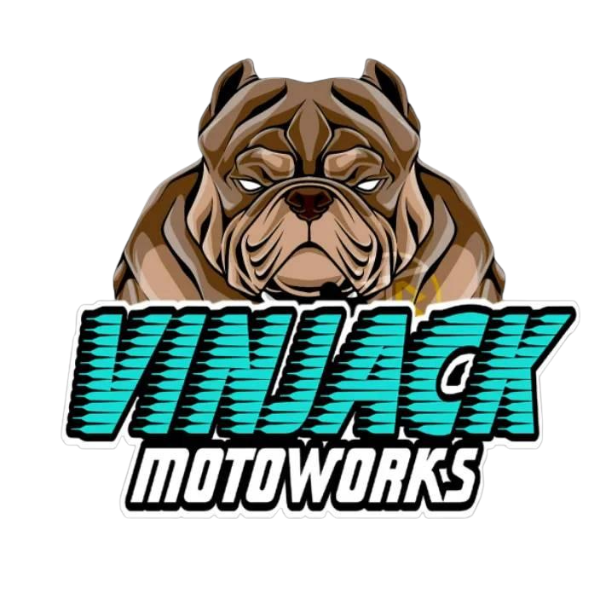
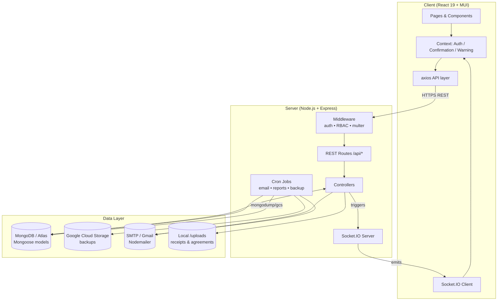
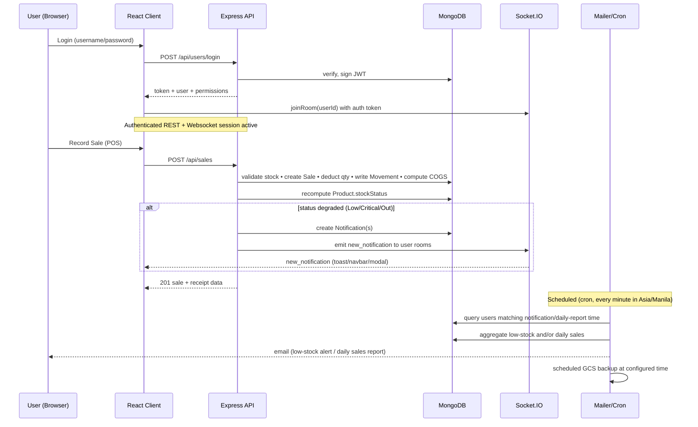
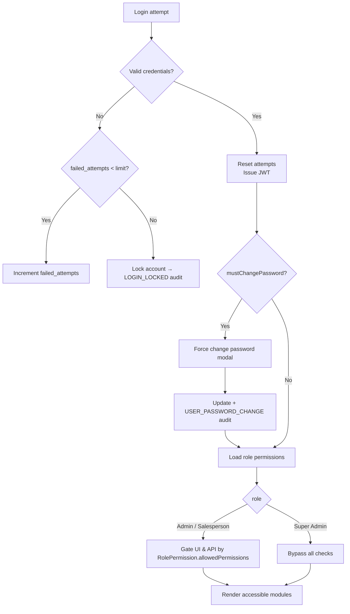
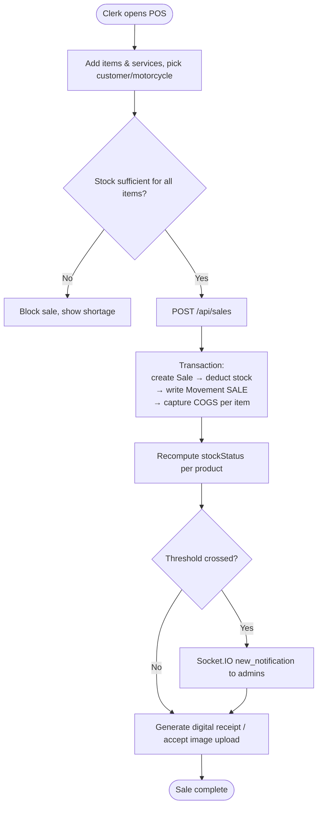

# VinJack Motorworks — Sales & Inventory Management System




> A centralized, secure, and real-time **web-based Sales & Inventory Management System** developed for **VinJack Motorworks**, a motorcycle repair and maintenance shop. The system replaces manual, notebook-based operations with a digital platform that automates inventory tracking, sales documentation, point-of-sale (POS) transactions, supplier & consignment management, and reporting.

---

## Table of Contents

- [Overview](#overview)
- [Authors & Acknowledgements](#authors--acknowledgements)
- [Key Features](#key-features)
- [Tech Stack](#tech-stack)
- [Dependencies](#dependencies)
- [System Architecture](#system-architecture)
- [Data Flow](#data-flow)
- [Core Business Flowcharts](#core-business-flowcharts)
  - [Authentication & Role-Based Access](#authentication--role-based-access)
  - [Walk-in Sales (POS)](#walk-in-sales-pos)
  - [Purchase Order & Consignment Lifecycle](#purchase-order--consignment-lifecycle)
  - [Stock Movement & Replenishment](#stock-movement--replenishment)
- [Data Schema](#data-schema)
- [Role & Permission Matrix](#role--permission-matrix)
- [Real-Time Notifications & Email Alerts](#real-time-notifications--email-alerts)
- [Backup & Restore](#backup--restore)
- [API Reference](#api-reference)
- [File Structure](#file-structure)
- [Testing](#testing)
- [Installation & Setup](#installation--setup)
- [Environment Variables](#environment-variables)
- [Available Scripts](#available-scripts)
- [Deployment](#deployment)
- [Roadmap](#roadmap)
- [License](#license)

---

## Overview

The **Web-Based Sales and Inventory Management System for VinJack Motorworks** is a full-stack **MERN** (MongoDB, Express, React, Node.js) application developed as an **IT Capstone Project** at **STI College Marikina**.

The shop previously relied on manual, paper-based records, leading to stock discrepancies, slow reporting, and limited accountability. This system provides:

- **Real-time stock monitoring** with automatic deductions on sales and services.
- **Role-Based Access Control (RBAC)** with granular, permission-level configuration for Admins and Salespersons.
- **Point-of-sale (POS)** workflow with stock validation and digital/physical receipt support.
- **Supplier & Purchase Order** management, including **consignment** tracking and supplier-side approval links.
- **Audit trail** of all user activities, plus **Google Cloud Storage (GCS)** database backups.
- **Visual dashboard & reports** with exportable daily, weekly, and monthly summaries.

---

## Authors & Acknowledgements

| Name | Role |
| --- | --- |
| **Alexander M. Oro** | Developer / Lead |
| **Selwyn Miles A. Jimenez** | Developer |
| **Joshua H. Villa-real** | Developer |

**Institution:** STI College Marikina — IT Capstone Project

---

## Key Features

### Security & Role-Based Access Control (RBAC)
- **Three roles:** `Super Admin` (Owner), `Admin` (Mechanic), `Salesperson` (Clerk).
- Passwords hashed via **`bcryptjs`**, authentication via **JWT**.
- Login attempt throttling with lockout + forced password change flow.
- **Granular permissions** — Super Admins bypass all checks; Admins and Salespersons are gated by a configurable permission matrix stored in MongoDB (`RolePermission` & `AllPermission` collections).

### Inventory Management
- Real-time stock with auto-deduction on sales/services and auto-restock on deliveries/returns.
- Stock classification by **Category** and **Brand**, plus **Consumables** vs **Replacement Parts**.
- **Stock status** auto-computed from `quantity` vs `maxStock`: `Healthy`, `Low`, `Critical`, `Out of Stock`.
- **Serialized item** support (serial-number tracking) for high-value units (e.g., engines, ECUs).
- **Consigned stock** tracked separately from owned stock.
- Low-stock visual warnings + email alerts (via Nodemailer).

### Sales & Service (POS)
- Walk-in POS that **blocks overselling** when stock is insufficient.
- Service transaction logging (e.g., CVT cleaning, remapping) with mechanic assignment.
- Digital receipt generation and optional physical-receipt image uploads.
- **Cost of Goods Sold (COGS)** captured at time of sale for accurate profit reporting.
- Secure **returns** workflow with outcomes: `Restocked`, `Refunded`, `Replaced`, `Discarded`.

### Supplier & Purchasing
- Supplier profiles with payment terms: `Cash`, `Consignment`, `Terms`.
- **Purchase Orders (POs)** for direct purchases and consignments.
- Supplier self-service **PO review/approval** via a tokenized public link (`/supplier/po/:token`).
- Signed agreement & countersigned agreement PDF uploads.
- Delivery verification and receipt uploads.
- **Consignment payable** tracking (items sold on consignment → amounts owed to suppliers).

### Dashboard & Reporting
- Summary cards: Total Revenue, Profit, Sales Count, Items Sold, Top-Selling Products.
- Exportable **daily / weekly / monthly** reports (Chart.js visuals, jsPDF export).
- Advanced filtering by date, category, and supplier.

### System Maintenance
- **Audit Trail:** Immutable log of 40+ action types (login/logout, item CRUD, sales, PO, etc.).
- **Stock Movement ledger:** Every stock change is journaled (`SALE`, `DELIVERY`, `ADJUSTMENT`, `RETURN`, `DELIVERY (PO)`).
- **Backup & Restore:** On-demand or scheduled MongoDB backups to **Google Cloud Storage**.

---

## Tech Stack

| Layer | Technology |
| --- | --- |
| **Frontend** | React 19, React Router 7, Material UI (MUI) v7, MUI X Data Grid, Emotion, Framer Motion, React Icons |
| **Charts & Reports** | Chart.js + react-chartjs-2, jsPDF + jspdf-autotable, react-to-print |
| **HTTP / Realtime** | Axios (REST), Socket.IO Client (real-time notifications) |
| **Backend** | Node.js, Express.js |
| **Database** | MongoDB (Community / Atlas) with Mongoose ODM |
| **Auth** | JSON Web Tokens (JWT), bcryptjs |
| **File Uploads** | Multer |
| **Scheduling** | node-cron (jobs: email alerts, sales reports, DB backups) |
| **Email** | Nodemailer |
| **Cloud / Backup** | Google Cloud Storage (`@google-cloud/storage`) |
| **Testing** | Jest, `mongodb-memory-server`, Supertest-style integration tests |
| **Tooling** | Nodemon, dotenv, CORS |

---

## Dependencies

### Server (`server/package.json`)
| Package | Purpose |
| --- | --- |
| `express` | REST API framework |
| `mongoose` | MongoDB ODM |
| `mongodb` | Driver (used by backup tooling) |
| `jsonwebtoken` | JWT auth tokens |
| `bcryptjs` | Password hashing |
| `cors` | Cross-origin requests |
| `dotenv` | Environment variables |
| `multer` | Multipart file uploads |
| `socket.io` | Real-time WebSocket notifications |
| `nodemailer` | Transactional email |
| `node-cron` | Scheduled jobs |
| `date-fns` / `date-fns-tz` | Date & timezone helpers |

**Dev:** `jest`, `mongodb-memory-server`, `nodemon`

### Client (`client/package.json`)
| Package | Purpose |
| --- | --- |
| `react` / `react-dom` | UI library (v19) |
| `react-router-dom` | Client routing (v7) |
| `@mui/material` / `@mui/icons-material` | UI components (v7) |
| `@mui/x-data-grid` | Data tables |
| `@mui/x-date-pickers` | Date pickers |
| `@emotion/react` / `@emotion/styled` | MUI styling engine |
| `framer-motion` | Animations |
| `react-icons` | Iconography |
| `axios` | HTTP client |
| `socket.io-client` | Realtime transport |
| `chart.js` / `react-chartjs-2` | Dashboard charts |
| `jspdf` / `jspdf-autotable` | PDF reports |
| `react-to-print` | Print receipts/reports |
| `react-toastify` | Toast notifications |
| `dayjs` / `date-fns` | Date handling |
| `validator` | Input validation |

---

## System Architecture

The application follows a classic **three-tier client–server** architecture with a real-time WebSocket overlay.



**Key architectural properties**
- **Stateless API** — JWT carried in `Authorization: Bearer` header; validated by `protect` middleware.
- **Single source of truth** — MongoDB holds all domain data; stock is mutated only through controllers that also write a `Movement` ledger entry.
- **Decoupled realtime** — Socket.IO pushes stock/threshold notifications to subscribed user rooms; REST remains the write path.
- **Graceful shutdown** — `SIGTERM`/`SIGINT` close the HTTP server then the Mongoose connection.

---

## Data Flow



---

## Core Business Flowcharts

### Authentication & Role-Based Access



### Walk-in Sales (POS)



### Purchase Order & Consignment Lifecycle

```mermaid
flowchart LR
    Created([Super Admin creates PO<br/>type=Purchase|Consignment]) --> Pending[Pending]
    Pending --> Send[Generate supplier review token<br/>public link /supplier/po/:token]
    Send --> Await{Supplier reviews}
    Await -- approves --> App[Approved]
    Await -- declines --> Can[Cancelled]
    App --> Upload{Consignment + Manual?}
    Upload -- agreement uploaded --> agre[Agreement Uploaded - Awaiting Delivery]
    Upload -- direct purchase --> deli
    agre --> deli[Record Delivery<br/>add to owned or consigned stock]
    deli --> Part{Fully received?}
    Part -- partial --> PR[Partially Received]
    Part -- yes --> Comp[Completed]
    PR --> Comp
    estilo{{For consignment sales:<br/>each sold item creates a ConsignmentPayable → Payout}}
    estilo --> Pay[Mark Paid → ConsignmentPayoutsPage]
```

### Stock Movement & Replenishment

```mermaid
flowchart TD
    Inc[Incoming stock] --> D1[Delivery via PO → type DELIVERY (PO)]
    D1 --> Upd[Product.quantity += qty<br/>or consignedStock += qty<br/>write Movement]
    Inc2[Direct delivery] --> D2[Delivery standalone → type DELIVERY]
    Manual[Stock Adjustment] --> Adj[Adjust quantity + note<br/>type ADJUSTMENT]
    Ret[Customer Return:<br/>Restocked/Replaced] --> Rtn[product.quantity += qty<br/>type RETURN]

    Dec[Outgoing stock] --> Sal[POS Sale → type SALE<br/>quantity -= qty]
    Dec --> SupRet[Supplier Return → reduce stock<br/>clear consigned if applicable]
    AdjustAll[All paths] --> Ledger[(Movements ledger)]
    Ledger --> Recompute[Recompute stockStatus + notifications]
```

---

## Data Schema

All collections use Mongoose with automatic `timestamps` (`createdAt`, `updatedAt`) unless noted. `ObjectId` references denoted with `→ Collection`.

### `User`
| Field | Type | Notes |
| --- | --- | --- |
| `fullName` | String | required |
| `username` | String | unique |
| `email` | String | unique, lowercase |
| `password` | String | bcrypt-hashed on save |
| `role` | Enum | `Super Admin` \| `Admin` \| `Salesperson` |
| `status` | String | default `pending` |
| `mustChangePassword` | Boolean | forced change flow |
| `failed_attempts` | Number | login throttle |
| `last_failed_attempt` | Date | |
| `emailSettings` | Object | `notificationsEnabled`, `notificationTime`, `dailySalesReportEnabled`, `dailySalesReportTime` |
| `dashboardPreferences` | Object | `timeRange`, `selectedCategory`, `selectedSupplier` |
| `pendingChanges` / `hasPendingChanges` | Object/Bool | owner-approved profile edits |
| `verificationCode` / `verificationCodeExpires` | String/Date | |

### `Product`
| Field | Type | Notes |
| --- | --- | --- |
| `itemCode` | String | unique |
| `name` | String | |
| `category` | ObjectId → `Category` | |
| `brand` | ObjectId → `Brand` | |
| `price` | Number | selling price |
| `quantity` | Number | total owned physical stock |
| `consignedStock` | Number | consigned physical stock |
| `maxStock` | Number | capacity for status calc (min 1) |
| `stockStatus` | Enum | `Healthy` \| `Low` \| `Critical` \| `Out of Stock` |
| `status` | Enum | `active` \| `inactive` |
| `unit` | String | default `pc` |
| `image` | String | URL/path |
| `supplierCosts` | Array | `{ supplier → Supplier, cost, note }` |
| `defaultCost` | Number | |
| `isSerialized` | Boolean | |
| `serializedItems` | Array | `{ serialNumber, status, purchaseOrder, dateReceived }` |

### `Sale`
| Field | Type | Notes |
| --- | --- | --- |
| `items` | Array | `{ product → Product, quantity, priceAtTime, costOfGoodsSold }` |
| `services` | Array | `{ service → Service, priceAtTime }` |
| `totalAmount` | Number | |
| `recordedBy` | ObjectId → `User` | |
| `customer` | ObjectId → `Customer` | optional |
| `motorcycle` | ObjectId → `Motorcycle` | optional |
| `customerReceiptImage` | String | |
| `isManualEntry` | Boolean | |

### `Service`
| Field | Type | Notes |
| --- | --- | --- |
| `name` | String | unique |
| `description` | String | |
| `charge` | Number | min 0 |
| `status` | Enum | `active` \| `inactive` |

### `Customer`
| Field | Type | Notes |
| --- | --- | --- |
| `name` | String | required |
| `email` | String | unique sparse |
| `phone` | String | |
| `address` | String | |
| `motorcycles` | Array[ObjectId → `Motorcycle`] | |

### `Motorcycle`
| Field | Type | Notes |
| --- | --- | --- |
| `owner` | ObjectId → `Customer` | required |
| `make` / `model` | String | |
| `year` | Number | |
| `color` | String | |
| `plateNumber` | String | unique sparse, uppercase |
| `vin` | String | unique sparse, uppercase |

### `Supplier`
| Field | Type | Notes |
| --- | --- | --- |
| `name` | String | unique |
| `email` | String | validated |
| `contactPerson` / `contactNumber` / `address` | String | |
| `status` | Enum | `Pending` \| `Approved` \| `Rejected` |
| `defaultPaymentTerms` | Enum | `Cash` \| `Consignment` \| `Terms` |

### `PurchaseOrder`
| Field | Type | Notes |
| --- | --- | --- |
| `poNumber` | String | unique (auto-generated via `Counter`) |
| `supplier` | ObjectId → `Supplier` | |
| `items` | Array | `{ product, quantity, cost, total, supplierUpdatedCost, isAvailable, quantityReceived, serialNumbers }` |
| `totalAmount` | Number | |
| `poType` | Enum | `Purchase` \| `Consignment` |
| `consignmentMethod` | Enum | `System` \| `Manual` |
| `termsAndConditions` | String | system-generated agreements |
| `status` | Enum | `Pending`, `Awaiting Approval`, `Approved`, `Partially Received`, `Completed`, `Cancelled`, `Agreement Uploaded - Awaiting Delivery` |
| `orderDate` | Date | |
| `notes` / `supplierNotes` | String | |
| `history` | Array | `{ status, notes, updatedBy, timestamp }` |
| `supplierResponseToken` | String | unique sparse — public review link |
| `deliveryReceiptUrl` | String | |
| `signedAgreementUrl` | String | supplier-signed PDF |
| `countersignedAgreementUrl` | String | owner-countersigned PDF |

### `Delivery`
| Field | Type | Notes |
| --- | --- | --- |
| `supplier` | ObjectId → `Supplier` | |
| `purchaseOrder` | ObjectId → `PurchaseOrder` | optional |
| `deliveryDate` | Date | |
| `deliveryType` | Enum | `Purchase` \| `Consignment` |
| `productsReceived` | Array | `{ product, quantity, costAtTime }` |
| `totalCost` | Number | |
| `recordedBy` | ObjectId → `User` | |

### `ConsignmentPayable`
| Field | Type | Notes |
| --- | --- | --- |
| `sale` | ObjectId → `Sale` | |
| `product` | ObjectId → `Product` | |
| `supplier` | ObjectId → `Supplier` | |
| `quantitySold` | Number | |
| `costAtTimeOfSale` | Number | |
| `amountOwed` | Number | |
| `status` | Enum | `Owed` \| `Paid` |
| `paidDate` | Date | |
| `recordedBy` | ObjectId → `User` | |

### `Return` (customer)
| Field | Type | Notes |
| --- | --- | --- |
| `originalSale` | ObjectId → `Sale` | |
| `itemsReturned` | Array | `{ product, quantity, priceAtTime }` |
| `servicesReturned` | Array | `{ service, priceAtTime }` |
| `reason` | String | required |
| `outcome` | Enum | `Restocked` \| `Refunded` \| `Replaced` \| `Discarded` |
| `totalRefundAmount` | Number | |
| `recordedBy` | ObjectId → `User` | |

### `SupplierReturn`
| Field | Type | Notes |
| --- | --- | --- |
| `supplier` | ObjectId → `Supplier` | |
| `productsReturned` | Array | `{ product, quantity, reason, wasConsigned }` (reason: `Defective`, `Wrong Item`, `Overstock`, `Other`) |
| `returnDate` | Date | |
| `notes` | String | |
| `recordedBy` | ObjectId → `User` | |
| `originalPurchase` | ObjectId (refPath) | optional — `PurchaseOrder` or `Delivery` |

### `Movement` (stock ledger)
| Field | Type | Notes |
| --- | --- | --- |
| `product` | ObjectId → `Product` | indexed |
| `type` | Enum | `SALE` \| `DELIVERY` \| `ADJUSTMENT` \| `RETURN` \| `DELIVERY (PO)` |
| `quantityChange` | Number | signed (+/-) |
| `stockBefore` / `stockAfter` | Number | |
| `referenceId` | String | linked Sale/Delivery doc |
| `notes` | String | for adjustments |
| `recordedBy` | ObjectId → `User` | |

### `AuditLog`
| Field | Type | Notes |
| --- | --- | --- |
| `user` | ObjectId → `User` | |
| `action` | Enum | 40+ actions (login, CRUD, backup, etc.) |
| `details` | String | |
| `entityType` / `entityId` | String/ObjectId | optional |

### `Notification`
| Field | Type | Notes |
| --- | --- | --- |
| `user` | ObjectId → `User` | indexed |
| `message` | String | |
| `type` | Enum | `LOW_STOCK` \| `CRITICAL_STOCK` \| `OUT_OF_STOCK` \| `USER_ACTION` \| `REQUEST_STATUS` |
| `link` | String | e.g. `/inventory` |
| `image` | String | |
| `isRead` | Boolean | indexed |

### Supporting collections
| Collection | Purpose |
| --- | --- |
| `Category` | `{ name (unique), description }` |
| `Brand` | `{ name (unique) }` |
| `Setting` | key/value system settings (`backup_schedule_enabled`, `backup_schedule_time`, …) |
| `Counter` | auto-increment sequence for `poNumber` generation |
| `RolePermission` | per-role allowed permission keys |
| `AllPermission` | master list of permissions (`key`, `description`, `category`, `defaultRoles`) |

---

## Role & Permission Matrix

| Module / Capability | Super Admin | Admin | Salesperson |
| --- | :---: | :---: | :---: |
| Dashboard (`canViewDashboard`) | ✅ | configurable | configurable |
| Inventory view (`canViewInventory`) | ✅ | configurable | configurable |
| Inventory manage (`canManageInventory`) | ✅ | configurable | configurable |
| Sales / POS (`canManageSales`) | ✅ | configurable | configurable |
| Customers (`canManageCustomers`) | ✅ | configurable | configurable |
| Returns (`canManageReturns`) | ✅ | configurable | configurable |
| Deliveries (`canManageDeliveries`) | ✅ | configurable | configurable |
| Purchase Orders (`canManagePurchaseOrders`) | ✅ | configurable | configurable |
| Suppliers view (`canViewSuppliers`) | ✅ | configurable | configurable |
| Suppliers manage (`canManageSuppliers`) | ✅ | configurable | configurable |
| Reports (`canViewReports`) | ✅ | configurable | configurable |
| User Management | ✅ | ❌ | ❌ |
| Data Management (backup/restore) | ✅ | ❌ | ❌ |
| Audit Log | ✅ | ❌ | ❌ |
| Permission Management | ✅ | ❌ | ❌ |

> Super Admin always has the implicit `SUPER_ADMIN_ALL` permission and bypasses `checkPermission`.

---

## Real-Time Notifications & Email Alerts

- **Socket.IO** server runs on the same Express HTTP server; clients authenticate with the JWT and `joinRoom(userId)`.
- Stock status transitions (`Healthy → Low/Critical/Out`) create `Notification` documents for **Super Admin** and **Admin** roles and emit `new_notification` events.
- The client `AuthContext` consumes events to render **toasts**, **navbar badges**, and a **warning modal**.
- **node-cron** schedules (run every minute, evaluated in `Asia/Manila`):
  - **Low-stock email alerts** — sent to users whose configured `notificationTime` matches the current minute.
  - **Daily sales report email** — aggregates revenue/COGS/profit/top products for "today" and emails users with `dailySalesReportEnabled`.
  - **Scheduled DB backup** — triggers a GCS backup when `backup_schedule_enabled` is `true` and `backup_schedule_time` matches.

---

## Backup & Restore

- Backups are produced by `backupService.js` (`backupDatabaseToGCS`) using MongoDB tooling and uploaded to a configured **GCS bucket**.
- Manual backups and restores are accessible to Super Admins via **Data Management** (`/data-management`).
- Restore action is fully audit-logged (`DATA_RESTORE_INITIATED`, `DATA_RESTORE_FAILED`, `DATA_BACKUP_GCS_MANUAL`, `DATA_EXPORT`).
- A `restoreCompleted` client flag triggers a success toast after restore.

---

## API Reference

All routes are prefixed with `/api`. Authentication via `Authorization: Bearer <JWT>`.

| Resource | Base Route | Notable Methods |
| --- | --- | --- |
| Users / Auth | `/api/users` | `POST /login`, `POST /demo-login`, `GET /me`, `PUT /force-change-password`, `POST /logout`, CRUD (Super Admin) |
| Products | `/api/products` | CRUD, `/low-stock`, low-stock warnings |
| Categories | `/api/categories` | CRUD |
| Brands | `/api/brands` | CRUD |
| Sales | `/api/sales` | create/list POS sales |
| Services | `/api/services` | CRUD service catalog |
| Customers | `/api/customers` | CRUD + motorcycle linkage |
| Motorcycles | `/api/motorcycles` | CRUD |
| Returns | `/api/returns` | customer returns |
| Suppliers | `/api/suppliers` | CRUD + approval flow |
| Purchase Orders | `/api/purchase-orders` | create, review, approve, receive |
| Deliveries | `/api/deliveries` | record deliveries |
| Consignment | `/api/consignment` | payables / payout tracking |
| Supplier Returns | `/api/supplier-returns` | returns to suppliers |
| Movements | `/api/movements` | stock ledger queries |
| Reports | `/api/reports` | dashboard aggregations |
| Notifications | `/api/notifications` | list + `/read` |
| Audit Logs | `/api/audit-logs` | immutable action log |
| Permissions | `/api/permissions` | manage role permissions |
| App Settings | `/api/app-settings` | system-wide settings |
| Settings | `/api/settings` | generic key/value |
| Adjustments | `/api/adjustments` | manual stock adjustments |

> Public (unauthenticated) route: `GET /supplier/po/:token` — supplier PO review page reads a related resource via the purchase-order token.

---

## File Structure

```
vinjack-system/
├── README.md
├── LICENSE.txt
├── package.json                  # root (multer-only helper)
├── client/                        # React 19 frontend (CRA)
│   ├── package.json
│   ├── .env.development           # REACT_APP_API_URL
│   ├── .env.production
│   ├── public/
│   │   └── assets/                # logo, motorcycle-bg, intro video
│   └── src/
│       ├── App.js                 # routes + providers
│       ├── index.js
│       ├── api/                   # axios instance + per-resource API modules
│       ├── context/               # AuthContext, ConfirmationContext, WarningContext
│       ├── components/            # Navbar, Sidebar, Modal classes, forms…
│       │   └── reports/           # PayoutHistory, ReturnsReport, SalesReport
│       └── pages/                 # 23 route screens
└── server/                        # Node.js + Express backend
    ├── index.js                   # app bootstrap + Socket.IO + graceful shutdown
    ├── jest.config.js
    ├── install_mongo_tools.sh      # helper: installs mongodump/mongorestore
    ├── config/
    │   └── db.js                   # Mongoose connection
    ├── models/                     # 20 Mongoose schemas
    ├── routes/                     # 22 Express routers
    ├── controllers/                # 22 controllers (business logic)
    ├── middleware/                 # auth (protect/authorize/checkPermission), multer
    ├── jobs/
    │   └── cronJobs.js             # email + sales report + backup schedule
    ├── utils/
    │   ├── stockManager.js         # stockStatus computation + notifications
    │   ├── movementLogger.js        # writes Movements ledger
    │   ├── notificationManager.js
    │   ├── emailService.js          # Nodemailer (low-stock, daily report)
    │   ├── backupService.js         # GCS backup
    │   ├── gcsStorage.js
    │   ├── logger.js
    │   └── migrateProducts.js
    ├── uploads/                    # receipts & agreements (served statically)
    ├── backups/                    # local backup staging
    └── __tests__/                  # 35 Jest test suites (models + controllers)
```

---

## Testing

The backend is covered by **35 Jest test suites** in `server/__tests__/`, exercising both **models** and **controllers** using an in-memory MongoDB via `mongodb-memory-server`.

```bash
cd server
npm test           # runs all Jest suites
```

The client ships with the default CRA test runner (`react-scripts test`).

---

## Installation & Setup

> **Prerequisites:** Node.js ≥ 14, a MongoDB instance (local Community Edition or Atlas), and (optionally) a GCS service-account JSON for backups and a Gmail app-password for email.

1. **Clone the repository**
   ```bash
   git clone https://github.com/bhimlex13/vinjack-system.git
   cd vinjack-system
   ```

2. **Install backend dependencies**
   ```bash
   cd server
   npm install
   ```

3. **Install frontend dependencies**
   ```bash
   cd ../client
   npm install
   ```

4. **Configure environment variables** — copy the example files and fill in your secrets:
   ```bash
   cp server/.env.example   server/.env
   cp client/.env.example    client/.env
   ```
   See [Environment Variables](#environment-variables) below.

5. **Run in development**
   ```bash
   # terminal 1 — backend (http://localhost:5000)
   cd server && npm run dev
   # terminal 2 — frontend (http://localhost:3000)
   cd client && npm start
   ```
   A demo login endpoint (`POST /api/users/demo-login`) is available for quick access without credentials.

---

## Environment Variables

### `server/.env`
| Variable | Example | Description |
| --- | --- | --- |
| `PORT` | `5000` | Express port |
| `MONGODB_URI` | `mongodb+srv://...` | MongoDB connection string |
| `JWT_SECRET` | *(long random string)* | JWT signing secret |
| `CLIENT_URL` | `http://localhost:3000` | CORS origin for the client |
| `EMAIL_USER` | `you@gmail.com` | Nodemailer sender address |
| `EMAIL_APP_PASSWORD` | *(Gmail app password)* | Nodemailer auth password |
| `GCS_BUCKET_NAME` | `my-backup-bucket` | GCS bucket for DB backups |
| `GOOGLE_APPLICATION_CREDENTIALS` | `./gcs-key.json` | Path to GCS service-account JSON |

### `client/.env`
| Variable | Example | Description |
| --- | --- | --- |
| `REACT_APP_API_URL` | `http://localhost:5000` | Base URL of the backend API |

> ⚠️ **Security note:** never commit real `.env` files. Only the sanitized `.env.example` templates are tracked in version control.

---

## Available Scripts

### Server (`/server`)
| Script | Command | Description |
| --- | --- | --- |
| Start | `npm start` | Installs Mongo tools then runs `node index.js` |
| Dev | `npm run dev` | Hot reload via `nodemon` |
| Test | `npm test` | Runs Jest test suites |

### Client (`/client`)
| Script | Command | Description |
| --- | --- | --- |
| Start | `npm start` | CRA dev server on port 3000 |
| Build | `npm run build` | Production build to `client/build/` |
| Test | `npm test` | Interactive CRA test runner |
| Eject | `npm run eject` | (advanced) reveal CRA config |

---

## Deployment

The backend is configured to **serve the built client** in production. When `NODE_ENV=production`, `index.js` statically serves `client/build/` and falls back to `index.html` for client-side routing.

A reference production API URL is configured in `client/.env.production` (`https://vinjack-server.onrender.com`).

**Typical production flow**
1. `cd client && npm run build`
2. Configure `server/.env` with production MongoDB, JWT secret, email, and GCS credentials.
3. `NODE_ENV=production npm start` (root or server) — single process serves both API and SPA on the configured `PORT`.
4. (Optional) Schedule GCS backups via **App Settings → backup schedule**, keeping `backup_schedule_enabled=true`.

---

## Roadmap

- Optional QR-code based item lookup at POS.
- Role permission caching layer for high-frequency `checkPermission` calls.
- Tenant/branch multi-shop support.
- WebSocket reconnection + offline queue for staff in low-connectivity service bays.

---

## License

This project is proprietary and was developed for the specific business operations of **VinJack Motorworks** as part of an academic **IT Capstone Project** at STI College Marikina.

All rights reserved. See the [LICENSE.txt](./LICENSE.txt) file for full terms. In summary:

- ✅ Permitted: internal business use by VinJack Motorworks, academic review, and evaluation by the capstone panel.
- ❌ Prohibited without prior written consent: commercial redistribution, resale, public relicensing, or derivative works.

© 2025 Alexander M. Oro, Selwyn Miles A. Jimenez, Joshua H. Villa-real. STI College Marikina.